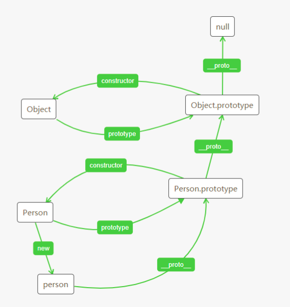

每个 JavaScript 引用类型都有原型，对象的 **proto** 属性指向它的原型，同时函数的 prototype 属性也是指向它的原型，而原型的原型还有原型，直至 null 为止形成一条原型链。

原型的用途的是，可以由特定类型的实例共享属性和方法。

举个栗子：定义一个构造函数 Person：

```
function Person() { }
Person.prototype.name = 'ghc'
Person.prototype.age = 24
Person.prototype.getName = function () {
    return this.name
}
const person = new Person()
console.log(person)  // { }
console.log(person.age)  // 24
console.log(person.getName())  // ghc
```

可以看到 person 实例是一个空对象，但是却可以访问到 age 属性和 getName 方法，这是因为这些属性和方法都定义在了 person 的原型上。

当代码访问 age 属性时，首先在实例本身开始检索，如果找到了 age 属性，则返回该属性，反之，就会继续向上检索 person 的原型，如果找到了 age 属性，则返回该属性，反之，则继续向上检索，直到 null 为止。

**实例、原型、构造函数之间的关系**

构造函数 Person 有个属性 prototype 就是构造函数的原型，这个原型默认有两个属性，一个是 constructor，一个是 **proto**。

constructor 就是指向构造函数 Person，即 Person.prototype.constructor === Person

**proto** 指向 Person 的原型的原型（Object.prototype）

然而 person 实例的原型就是 Person 构造函数的原型，即 Object.getPrototypeOf(person) === Person.prototype

具体逻辑如下图：


